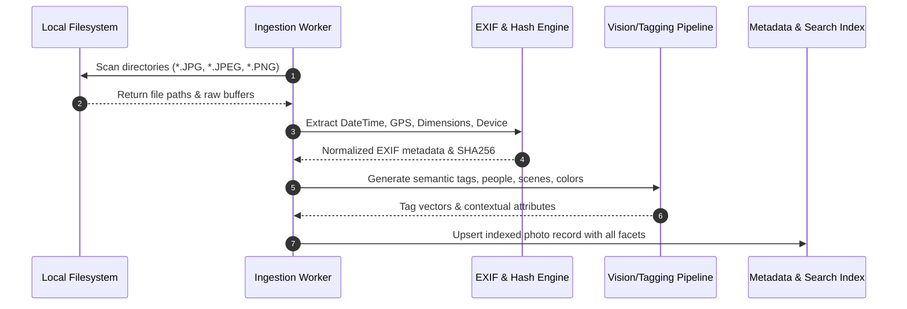
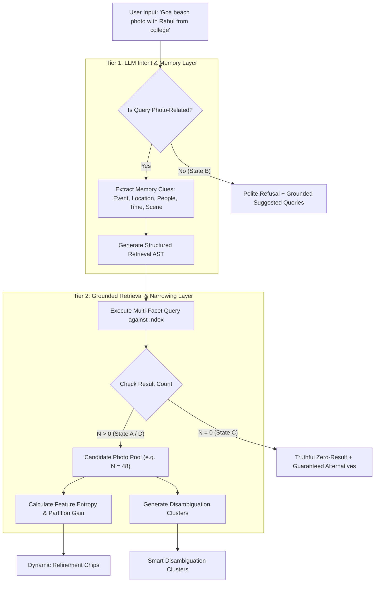
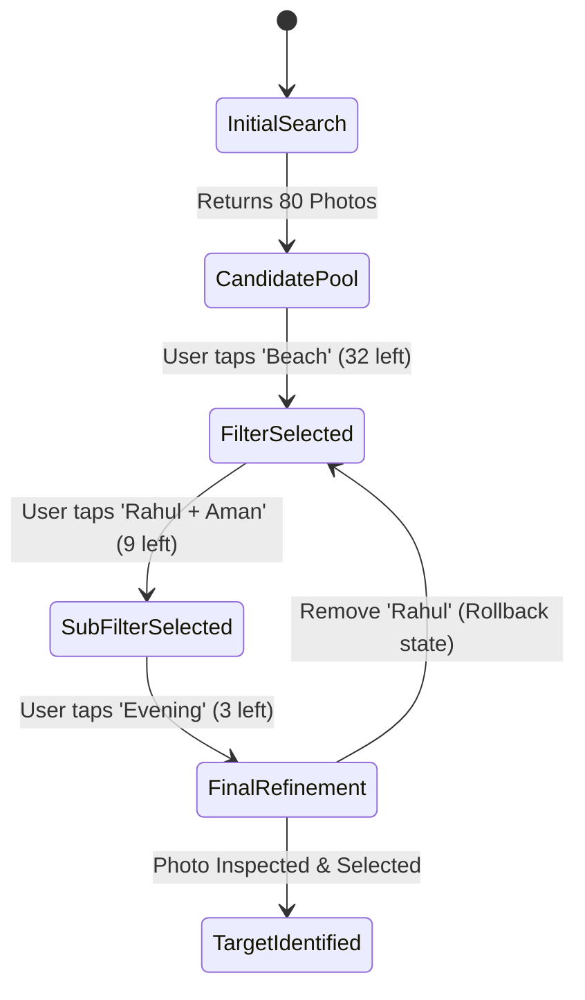
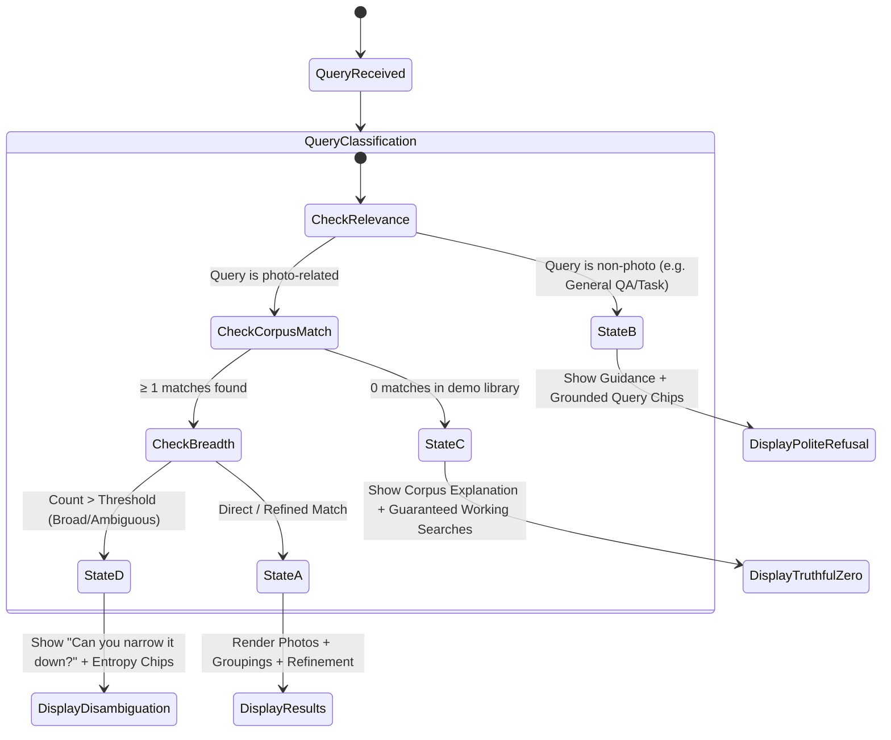
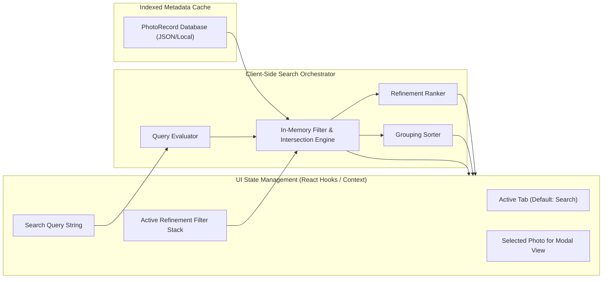

# System Architecture & Technical Design: Vague-Memory Photo Retrieval in Google Photos MVP

---

## 1. Executive Summary & System Goals

This document outlines the technical architecture, component design, data flow, indexing pipeline, and interface specifications for the **Vague-Memory Photo Retrieval MVP** in **Google Photos (iOS)**.

The system addresses the fundamental limitation of traditional photo search when users recall photos through **incomplete contextual memories** (events, people, approximate timeframes, activities, or visual details) rather than precise dates or exact keywords.

### Core Objectives:
1. **Pixel-Perfect iOS Google Photos Experience:** Replicate the authentic iOS app interface within a mobile device shell, anchoring the experience within the **Search** tab and primary navigation tabs (`Photos`, `Collections`, `Create`, `Search`).
2. **Grounded Authoritative Retrieval:** Execute 100% of retrieval, grouping, and suggestions strictly against the local project photo corpus (zero hallucinations, zero web search, zero fake images).
3. **Feature 1 — Guided Search Refinement:** Provide progressive, dynamic refinement options (entropy-ranked chips) that mathematically narrow the candidate search space.
4. **Feature 2 — Smart Result Grouping & Disambiguation:** Dynamically cluster large candidate sets into meaningful contextual facets (sub-events, people, times of day, locations, activities) to avoid undifferentiated grid overload.
5. **Deterministic Query State Machine:** Truthfully handle valid results (State A), non-photo queries (State B), out-of-corpus queries (State C), and overly broad queries (State D).

---

## 2. High-Level System Architecture

The application is structured into three primary tiers: the **iOS Presentation Layer**, the **Retrieval & Intelligence Gateway (Orchestrator)**, and the **Authoritative Photo Indexing & Storage Engine**.

```mermaid
graph TD
    subgraph Client ["Client Tier (Google Photos iOS Shell)"]
        UI[iPhone 15 Pro Frame & Status Bar]
        Nav[Bottom Navigation: Photos | Collections | Create | Search]
        SearchTab[Search Tab & Ask Photos Experience]
        Chips[Refinement Chip Bar & State Manager]
        Groups[Smart Result Grouping Carousel/Clusters]
        Grid[Interactive Timeline & Photo Grid]
        Detail[Full-Screen Photo Detail & EXIF Inspector]
    end

    subgraph Gateway ["Orchestration & Retrieval Engine"]
        Router[Query Router & State Dispatcher]
        LLM_Engine[LLM Intent & Memory Interpreter]
        Ranker[Information Gain & Entropy Refinement Ranker]
        Clusterer[Multi-Dimensional Result Clusterer]
        Guardrail[Strict Corpus Grounding Guardrail]
    end

    subgraph Data ["Authoritative Data & Indexing Tier"]
        Corpus[(Project Photo Library / Workspace Folders)]
        MetadataStore[(SQLite / JSON Vector & Metadata Store)]
        ExifParser[EXIF & Temporal Indexer]
        SemanticIndex[Semantic Tagging & Embeddings]
    end

    UI --> Nav
    Nav --> SearchTab
    SearchTab --> Router
    Router --> Guardrail
    Guardrail --> LLM_Engine
    LLM_Engine --> MetadataStore
    MetadataStore --> Ranker
    MetadataStore --> Clusterer
    Ranker --> Chips
    Clusterer --> Groups
    MetadataStore --> Grid
    Corpus --> ExifParser
    Corpus --> SemanticIndex
    ExifParser --> MetadataStore
    SemanticIndex --> MetadataStore
```

---

## 3. Authoritative Photo Library & Ingestion Pipeline

### 3.1 Corpus Ingestion Architecture
The project workspace contains structured directories (e.g., `201412_a`, `201705_a`, `202001_a`, etc.) containing actual images. The ingestion pipeline extracts deterministic EXIF metadata and generates semantic visual descriptors.



### 3.2 Canonical Photo Schema (`PhotoRecord`)
```typescript
interface PhotoRecord {
  id: string;                      // Unique identifier (hash/path slug)
  filePath: string;                // Relative path to local asset
  fileName: string;                // Original filename (e.g., HZNB4190.JPG)
  url: string;                     // Static serving URL
  timestamp: string;               // ISO 8601 string (from EXIF)
  year: number;                    // e.g., 2016
  month: number;                   // 1 - 12
  timeOfDay: 'morning' | 'afternoon' | 'evening' | 'night';
  location?: {
    city?: string;
    placeName?: string;            // e.g., "Anjuna Beach", "North Goa"
    country?: string;
    latitude?: number;
    longitude?: number;
  };
  eventContext: string[];          // e.g., ["Goa Trip", "College Days", "Annual Meet"]
  people: string[];                // e.g., ["Rahul", "Aman", "Priya"]
  scenes: string[];                // e.g., ["Beach", "Restaurant", "Hotel Room", "Poolside"]
  activities: string[];            // e.g., ["Swimming", "Dining", "Partying", "Walking"]
  objects: string[];               // e.g., ["Sunset", "Water", "Food", "Guitar", "Car"]
  visualCharacteristics: {
    isSelfie: boolean;
    isGroupPhoto: boolean;
    isBurstCandidate: boolean;
    burstGroupId?: string;
    dominantColors: string[];
    aspectRatio: number;
  };
  textOcr?: string[];              // Extracted text on signs/shirts if any
  searchVector?: number[];         // Semantic embedding vector (optional/precomputed)
}
```

---

## 4. Dual-Layer Retrieval & Intelligence Architecture

The architecture enforces strict separation of concerns between natural language interpretation and deterministic data retrieval.



### 4.1 Tier 1: LLM Intent & Entity Parser
The LLM converts conversational memory clues into a structured search filter:
```json
{
  "isPhotoQuery": true,
  "confidence": 0.98,
  "extractedEntities": {
    "events": ["Goa Trip"],
    "lifePhases": ["College"],
    "people": ["Rahul"],
    "locations": ["Beach", "Goa"],
    "timeRange": { "approxYear": 2016 },
    "scenes": ["Beach", "Water"],
    "activities": []
  },
  "rawSummary": "Searching for Goa trip beach photos with Rahul during college years."
}
```

### 4.2 Tier 2: Grounded Search & Entropy-Based Refinement
To prevent overwhelming the user and avoid static, unhelpful filters, the system calculates **Feature Partition Gain** over the active candidate set:

$$\text{Gain}(F) = - \sum_{v \in \text{Values}(F)} \frac{|C_v|}{|C|} \log_2 \left(\frac{|C_v|}{|C|}\right)$$

Where:
- $C$ is the current candidate set.
- $C_v$ is the subset of photos containing attribute value $v$.
- Attributes with high partition gain (e.g., distinguishing between "Day" vs "Night", or "Beach" vs "Restaurant") are promoted to the top of the **Refinement Chip Bar**.
- Filters that match $0$ photos or $100\%$ of photos are automatically pruned.

---

## 5. Feature Deep-Dive

### 5.1 Feature 1: Guided Search Refinement
- **Interactive State Stack:** Maintains the breadcrumb of applied constraints (`[Goa Trip] -> [+Beach] -> [+Rahul] -> [+Evening]`).
- **Instant Candidate Recalculation:** Every chip toggle immediately executes an intersection query:
  $$\text{ResultSet} = C_0 \cap F_1 \cap F_2 \cap \dots \cap F_k$$
- **Dynamic Chip Regeneration:** When a chip is selected, the remaining candidate set is re-profiled to generate the next set of relevant refinement chips.



### 5.2 Feature 2: Smart Result Grouping & Disambiguation
When the candidate set is large ($\ge 6$ photos), the candidate set is automatically partitioned into dynamic group sections:

1. **Event & Sub-Event Clusters:** e.g., *"Goa Trip · Day 1 Arrival"*, *"Anjuna Beach Sunsets"*.
2. **People Clusters:** Groups based on co-occurrence (e.g., *"Rahul & Aman (18 photos)"*, *"Full Group (12 photos)"*).
3. **Temporal / Scene Clusters:** e.g., *"Night & Dinner (14 photos)"*, *"Water & Boating (10 photos)"*.
4. **Visual Similarity / Burst Deduplication:** Visually identical burst shots are grouped into a single expandable cluster card to prevent visual clutter.

---

## 6. Query States & Fallback State Machine

The retrieval orchestrator maps every incoming query into one of four deterministic states:



### State Definitions & UI Contracts

| State | Condition | UI Component Behavior | Guardrail Guarantee |
| :--- | :--- | :--- | :--- |
| **State A** | Photo query with $\ge 1$ results | Displays conversational summary, refinement chips, grouping carousel, and photo grid. | All photo thumbnails link to verified local files. |
| **State B** | Non-photo query (e.g., *"Write a poem"*) | Rejects gracefully with Google Photos helper card and grounded suggestion pills. | Suggestions strictly derived from indexed events/people in the corpus. |
| **State C** | Valid query with 0 matches in library | Truthfully explains demo corpus boundaries and provides guaranteed alternative search pills. | No synthetic images, stock photos, or false claims of discovery. |
| **State D** | Broad query (e.g., *"friends"*, $> 30$ photos) | Shows *"Can you narrow it down?"* prompt card and prominent entropy-ranked refinement chips. | Selecting any suggested chip reduces candidates and never results in an empty state. |

---

## 7. Frontend UI / UX Architecture (Google Photos iOS Shell)

### 7.1 Visual Design Tokens (Material 3 + iOS Hybrid)
- **Colors:**
  - Background: Light `#FFFFFF` / Dark `#121212` / Surface `#F8F9FA`
  - Primary / Accent: Google Blue `#1A73E8`
  - Search Pill Background: `#EDF2FA` (Google Blue Tint)
  - Text Primary: `#202124` (High Contrast)
  - Text Secondary: `#5F6368` (Muted Label)
  - Chip Active: Background `#E8F0FE`, Border `#1A73E8`, Text `#1A73E8`
- **Typography:** Google Sans / Roboto / SF Pro Display system stack with native weights (400, 500, 600).
- **Layout:** Exact iPhone viewport container (393px $\times$ 852px frame with rounded corners, Dynamic Island, status bar, and home indicator).

### 7.2 Component Hierarchy
```
AppContainer (Root)
│
└── IPhoneShell (Viewport container, bezel, Dynamic Island, iOS Status Bar)
    │
    ├── TopBar (Dynamic: App title / Avatar / Search input bar / Back button)
    │
    ├── MainContentArea (Screen view switcher based on active tab)
    │   ├── PhotosScreen (Chronological timeline grid, monthly sections, pinch simulation)
    │   ├── CollectionsScreen (Albums, People & Pets, Places, Documents cards)
    │   ├── CreateScreen (Collages, Highlight videos, Cinematic photos)
    │   └── SearchScreen (PRIMARY MVP CONTAINER)
    │       ├── DefaultSearchHome (Ask Photos header, recent searches, categories)
    │       ├── ActiveSearchSession
    │       │   ├── SearchQueryInput (Natural language prompt with voice & lens icons)
    │       │   ├── AskPhotosSummaryCard (Conversational LLM synthesis with sparkle badge)
    │       │   ├── RefinementChipBar (Horizontal scroll of entropy-ranked filter chips)
    │       │   ├── SmartGroupSection (Tabbed or card clusters: Sub-events, People, Scenes)
    │       │   ├── CandidatePhotoGrid (Responsive masonry grid with badge overlays)
    │       │   └── EmptyStateFallback (State B & C dedicated recovery cards)
    │       └── PhotoDetailModal (Full-screen preview, EXIF info drawer, share/favorite actions)
    │
    └── BottomTabBar (Fixed Google Photos iOS bar: [Photos, Collections, Create, Search])
```

---

## 8. Data Flow & State Management



---

## 9. Technology Stack Recommendation

| Layer | Recommended Technology | Rationale |
| :--- | :--- | :--- |
| **Framework** | **React (Vite) + TypeScript** | Ultra-fast local development, non-interactive build, single-page responsiveness for native iPhone simulator feel. |
| **Styling** | **Vanilla CSS / CSS Modules** | Complies with tech stack guidelines (Vanilla CSS for maximum control), enables pixel-perfect Google Photos iOS tokens and fluid micro-animations. |
| **Icons & Assets** | **Google Material Symbols & Lucide** | Accurate Google Photos icons (Search, Sparkle/Gemini, Collections, Lens, Share, Trash, Star). |
| **Indexing & Serving** | **Local Node/Vite Asset Pipeline** | Directly mounts and serves workspace directories (`201412_a`, `201705_a`, etc.) as authoritative static assets with pre-extracted metadata. |
| **Semantic & Filter Engine** | **TypeScript In-Memory Index + LLM Gateway** | Zero-latency instant filtering on chip clicks, deterministic entropy calculation, and local AI interpretation. |

---

## 10. Verification & Acceptance Criteria Matrix

| # | Acceptance Criterion | Verification Method |
| :---: | :--- | :--- |
| **1** | **Authentic iOS Shell** | Visual inspection of iPhone bezel, status bar, bottom navigation (`Photos`, `Collections`, `Create`, `Search`). |
| **2** | **Authoritative Corpus Search** | Validate that search queries query actual image files found in workspace directories. |
| **3** | **Grounded Results** | Inspect image `src` attributes to verify they point to real local files. |
| **4** | **Guided Search Refinement** | Perform a broad query (`"Goa trip"`) $\rightarrow$ verify dynamic chips appear $\rightarrow$ click chip $\rightarrow$ candidate count decreases. |
| **5** | **Smart Result Grouping** | Perform query $\rightarrow$ verify candidate photos are categorized into sub-clusters (e.g., Beach, Dining, Night). |
| **6** | **Dynamic State Updates** | Toggle/untoggle filter chips $\rightarrow$ verify photo grid and remaining chip options update dynamically. |
| **7** | **Non-Photo Query Handling** | Submit query `"What is the capital of France?"` $\rightarrow$ verify polite rejection + library-grounded suggestions. |
| **8** | **Truthful Zero-Result State** | Submit query for non-existent item $\rightarrow$ verify clear explanation without hallucinated results. |
| **9** | **Guaranteed Fallbacks** | Click any suggestion pill from State B or C $\rightarrow$ verify it leads to $\ge 1$ valid photo. |
| **10** | **Zero Fabrication** | Code audit confirming no stock/mock images or fabricated responses are used. |
| **11** | **End-to-End Native UX** | Execute the complete user journey from vague memory to photo identification without leaving the iOS shell. |
