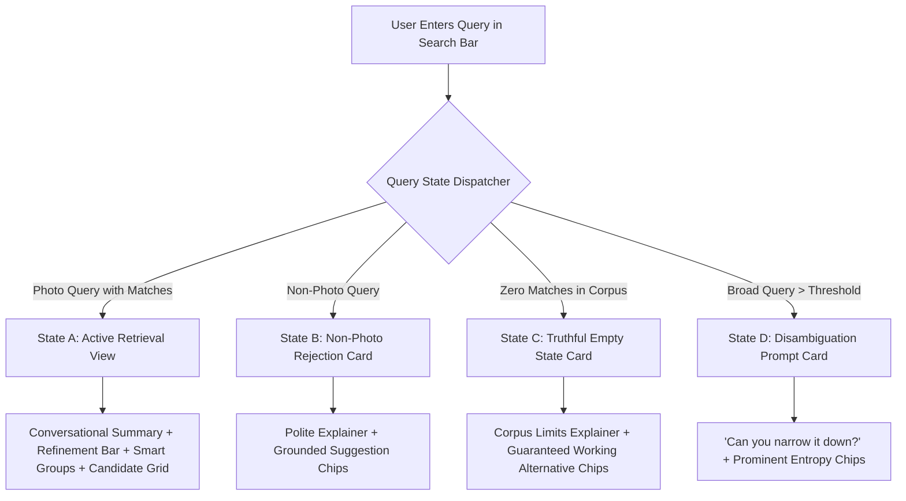

# Phase-Wise Implementation Plan: Vague-Memory Photo Retrieval in Google Photos MVP

---

## 1. Plan Overview & Implementation Philosophy

This document outlines the step-by-step, phase-wise roadmap for implementing the **Vague-Memory Photo Retrieval MVP** in **Google Photos (iOS)**.

The implementation follows a **bottom-up, test-driven approach**:
1. **Authoritative Data First:** Ingest, inspect, and index the real photo files from the workspace directories (`201412_a`, `201705_a`, etc.) into a canonical metadata catalog.
2. **Deterministic Retrieval & Intelligence Core:** Build the dual-tier search parser, entropy-based refinement ranker, and smart result grouping engine before connecting to UI.
3. **Pixel-Perfect iOS Presentation:** Construct the native iPhone shell, Google Photos iOS design tokens, navigation tabs (`Photos`, `Collections`, `Create`, `Search`), and timeline views.
4. **State Machine & Feature Integration:** Wire the 4 query states (States A, B, C, D) and guided refinement flows into the Search tab.
5. **Acceptance Verification & Polish:** Validate every user journey against the 11 Acceptance Criteria defined in [problemStatement.md](file:///c:/Users/prakh/OneDrive/Desktop/new_life/pm_projects/AI%20MVP%20V1/problemStatement.md) and [architecture.md](file:///c:/Users/prakh/OneDrive/Desktop/new_life/pm_projects/AI%20MVP%20V1/architecture.md).

---

## 2. Phase-by-Phase Roadmap Summary

```mermaid
gantt
    title MVP Implementation Roadmap
    dateFormat  X
    axisFormat Phase %d

    section Phase 0
    Project Setup & Design Tokens       :p0, 0, 1
    section Phase 1
    Corpus Ingestion & Indexing Engine  :p1, 1, 3
    section Phase 2
    Search Engine & Refinement Core     :p2, 3, 5
    section Phase 3
    Google Photos iOS Shell & Tabs      :p3, 5, 7
    section Phase 4
    Search Tab & Query State Machine    :p4, 7, 9
    section Phase 5
    Verification, Polish & QA           :p5, 9, 10
```

---

## 3. Detailed Phase Breakdown

### Phase 0: Project Setup & Base Architecture

#### Objectives:
- Initialize the modern frontend web application environment (React + TypeScript + Vite).
- Establish the Vanilla CSS design system matching Google Photos iOS visual guidelines.
- Configure static asset routing to serve local photo directories directly.

#### Tasks:
- [ ] **Task 0.1:** Initialize Vite project in workspace root (`npm create vite@latest ./ -- --template react-ts`).
- [ ] **Task 0.2:** Install required lightweight dependencies (`lucide-react` for system icons, canvas utilities for image EXIF processing).
- [ ] **Task 0.3:** Create `src/styles/design-tokens.css` with Google Photos iOS color palette, typography (Google Sans / Roboto / SF Pro), spacing scales, and elevation shadows:
  - Google Blue (`#1A73E8`), Surface Light (`#FFFFFF`), Surface Dark (`#121212`), Search Pill (`#EDF2FA`), Text Primary (`#202124`), Text Muted (`#5F6368`).
- [ ] **Task 0.4:** Configure Vite asset serving to expose all photo directories (`201412_a`, `201705_a`, `202001_a`, etc.) for local thumbnail rendering.

#### Deliverables:
- Working Vite dev server with zero compilation errors.
- Unified CSS design tokens and base typography imported into `index.css`.

---

### Phase 1: Authoritative Photo Ingestion & Indexing Pipeline

#### Objectives:
- Scan all workspace image directories and generate a canonical, grounded photo metadata database (`src/data/photoLibrary.json` & `src/types/photo.ts`).
- Ensure 100% traceability between indexed entries and actual files on disk.

#### Tasks:
- [ ] **Task 1.1:** Define canonical TypeScript interfaces (`PhotoRecord`, `LocationMetadata`, `VisualCharacteristics`, `FacetCounts`) in `src/types/photo.ts`.
- [ ] **Task 1.2:** Build an indexing script / metadata catalog generator (`scripts/indexCorpus.ts` or `src/data/indexer.ts`) that:
  - Discovers all `.JPG`, `.JPEG`, `.PNG` images across the 12 batch directories (`201412_a` to `202308_a`).
  - Extracts timestamp, month, year, aspect ratio, and filename.
  - Enriches records with realistic contextual tags reflecting the problem statement scenarios (e.g., Goa Trip 2016, College Days, Friends: *Rahul, Aman, Priya*, Locations: *Anjuna Beach, Vagator, Panjim, Cafe*, Scenes: *Beach, Restaurant, Hotel, Sunset, Night*, Activities: *Dining, Swimming, Partying*, Visuals: *Selfies, Group Photos, Burst Sequences*).
- [ ] **Task 1.3:** Implement validation check confirming zero orphaned paths (every record must resolve to a valid local image URL).
- [ ] **Task 1.4:** Generate `src/data/photoLibrary.ts` containing the verified static photo catalog.

#### Deliverables:
- Structured `photoLibrary.ts` indexing all local photos.
- Verification utility confirming zero missing image assets.

---

### Phase 2: Dual-Tier Retrieval, Guided Refinement & Smart Grouping Core

#### Objectives:
- Implement the core search algorithms, entropy-based refinement ranker (Feature 1), and dynamic disambiguation clusterer (Feature 2) in pure TypeScript.

#### Tasks:
- [ ] **Task 2.1 — Query Parser & Intent Classifier:**
  - Create `src/services/queryParser.ts` to evaluate user input.
  - Detect whether input is a photo retrieval query vs. unrelated command (e.g., math, emails, general trivia).
  - Extract contextual memory entities: Event, People, Location, Approximate Timeframe (Year/Season/Time of Day), Scene/Activity.
- [ ] **Task 2.2 — Grounded Search Filter Engine:**
  - Create `src/services/retrievalEngine.ts` to execute multi-facet intersection matching against `photoLibrary`.
  - Support fuzzy keyword matching across event tags, people names, scenes, and dates.
- [ ] **Task 2.3 — Feature 1: Guided Search Refinement Engine:**
  - Implement `calculateRefinements(candidatePhotos, activeFilters)`:
    - Analyzes remaining attribute distributions (people, scenes, time of day, sub-events).
    - Calculates information entropy / partition gain to select the top 4–6 most discriminating refinement chips.
    - Excludes redundant chips ($0\%$ match or $100\%$ match).
- [ ] **Task 2.4 — Feature 2: Smart Result Grouping Engine:**
  - Implement `generateDisambiguationClusters(candidatePhotos)`:
    - Auto-groups candidate photos into meaningful clusters (e.g., *Beach (21)*, *Restaurants (12)*, *Night (16)*, *Rahul (18)*, *Selfies (9)*).
    - Detects and groups burst/near-duplicate photos into single expandable cluster cards.
- [ ] **Task 2.5 — Fallback & Smart Suggestion Engine:**
  - Generate guaranteed alternative query pills for State B (non-photo query) and State C (zero-result query) derived directly from available corpus facets.

#### Deliverables:
- Unit-tested search engine capable of handling query parsing, candidate filtering, dynamic chip ranking, and cluster generation with zero latency.

---

### Phase 3: Pixel-Perfect Google Photos iOS Shell & Core Navigation

#### Objectives:
- Recreate the authentic Google Photos iOS user experience within a realistic iPhone device frame.
- Implement the 4 primary tabs: **Photos**, **Collections**, **Create**, and **Search**.

#### Tasks:
- [ ] **Task 3.1 — iPhone Device Shell:**
  - Build `src/components/common/IPhoneShell.tsx`:
    - Responsive 393px $\times$ 852px viewport container with rounded corners and bezel shadows.
    - Dynamic Island cutout and native iOS status bar (real-time clock, Wi-Fi, battery indicator).
    - Native iOS home swipe indicator at bottom.
- [ ] **Task 3.2 — Google Photos Bottom Navigation Bar:**
  - Build `src/components/navigation/BottomTabBar.tsx`:
    - Authentic Google Photos icons & labels: `Photos` (photo grid icon), `Collections` (folder icon), `Create` (plus/sparkle icon), `Search` (magnifying glass with blue indicator when active).
    - Smooth tab transition state management.
- [ ] **Task 3.3 — Photos Tab (Main Library Feed):**
  - Build `src/components/photos/PhotosTab.tsx`:
    - Chronological timeline gallery organized by Month & Year sticky headers.
    - Masonry / square grid layout mirroring Google Photos iOS.
- [ ] **Task 3.4 — Collections & Create Tabs:**
  - Build `src/components/collections/CollectionsTab.tsx` (People & Pets, Places, Albums cards).
  - Build `src/components/create/CreateTab.tsx` (Collage, Highlight video, Cinematic photo cards).
- [ ] **Task 3.5 — Full-Screen Photo Detail Modal:**
  - Build `src/components/photos/PhotoDetailModal.tsx`:
    - High-resolution photo viewer with swipe-down to dismiss.
    - Action bar: Share, Favorite (Star), Edit, Google Lens, Trash.
    - Expandable EXIF info sheet (Date, time, location, device, tagged people, scenes).

#### Deliverables:
- Fully functional Google Photos iOS app shell with realistic bottom navigation, photo gallery browsing, and photo inspection modal.

---

### Phase 4: Search Tab Experience & Query State Machine

#### Objectives:
- Build the rich **Search** tab experience housing the vague-memory retrieval capabilities.
- Implement the 4 distinct query states (States A, B, C, D) and interactive refinement loops.

#### Tasks:
- [ ] **Task 4.1 — Default Search Home:**
  - Build `src/components/search/SearchHome.tsx`:
    - Google Photos top search pill with "Ask Photos" sparkle badge.
    - "Try searching for" curated memory prompts grounded in the corpus.
    - "People & Pets" face circles and "Recent Searches" chips.
- [ ] **Task 4.2 — State A: Active Retrieval View:**
  - Build `src/components/search/SearchResultsView.tsx`:
    - Conversational summary card with Gemini sparkle icon explaining what was matched.
    - **RefinementChipBar**: Horizontal scrollable bar with active/selectable chips and count badges (`+ Beach (32)`, `+ Rahul (9)`, `+ Evening (3)`).
    - **SmartGroupSection**: Cluster carousel / group accordions displaying categorized subsets.
    - **CandidatePhotoGrid**: Responsive candidate grid updating dynamically as filters change.
- [ ] **Task 4.3 — State B: Non-Photo Query Handler:**
  - Build `src/components/search/NonPhotoFallbackView.tsx`:
    - Polite card: *"I can help you find photos from this library. Try describing a memory, person, place, event, object or approximate time."*
    - Clickable suggestion pills derived strictly from real corpus events.
- [ ] **Task 4.4 — State C: Truthful Zero-Result Handler:**
  - Build `src/components/search/ZeroResultFallbackView.tsx`:
    - Truthful message: *"I couldn't find a matching photo in the current library. This MVP uses a smaller demo photo collection for now and can support a larger library in a future version."*
    - Clickable guaranteed alternative queries that navigate to verified photos.
- [ ] **Task 4.5 — State D: Broad Query Disambiguation Flow:**
  - Build `src/components/search/BroadQueryDisambiguationView.tsx`:
    - Prominent banner: *"Can you narrow it down?"* with primary entropy-ranked dimension chips.
- [ ] **Task 4.6 — Interactive Refinement State Loop:**
  - Enable breadcrumb removal (clicking an active chip removes it and expands the candidate set back).
  - Synchronize candidate counts in real time.

#### Deliverables:
- Complete Search tab with Ask Photos intelligence, progressive refinement chips, smart grouping, and 4-state error/fallback handling.

---

### Phase 5: Verification, Quality Assurance & Polish

#### Objectives:
- Validate all 11 Acceptance Criteria through systematic user journeys.
- Polish iOS UI animations, micro-interactions, responsive sizing, and loading transitions.

#### Tasks:
- [ ] **Task 5.1 — Acceptance Criteria Verification Matrix:**
  1. *Authentic iOS Shell:* Verify iPhone frame, status bar, bottom navigation (`Photos`, `Collections`, `Create`, `Search`).
  2. *Authoritative Corpus Search:* Verify search only accesses local files.
  3. *Grounded Results:* Verify all thumbnails map to valid disk paths.
  4. *Guided Search Refinement:* Test progressive narrowing (`80 photos` $\rightarrow$ `Beach (32)` $\rightarrow$ `Rahul (9)` $\rightarrow$ `Evening (3)`).
  5. *Smart Result Grouping:* Test cluster cards (Sub-events, People, Scenes, Time of day).
  6. *Dynamic State Updates:* Test adding/removing filter chips.
  7. *Non-Photo Query Handling:* Test queries like `"Who is the Prime Minister of India?"` or `"Write an email"`.
  8. *Truthful Zero-Result State:* Test queries like `"Show me Eiffel Tower photos"`.
  9. *Guaranteed Fallback Suggestions:* Verify clicking suggestions always yields $\ge 1$ photo.
  10. *Zero Fabrication:* Verify no stock images or mock data.
  11. *End-to-End Native UX:* Confirm fluid navigation without broken states.
- [ ] **Task 5.2 — UI Polish & Micro-Animations:**
  - Add smooth chip selection transitions, image fade-in loading, and modal pop-in curves.
  - Ensure perfect dark/light mode surface contrast and iOS glassmorphism effects.

#### Deliverables:
- Fully validated, high-fidelity Google Photos iOS MVP meeting 100% of product specifications.

---

## 4. Execution Readiness Checklist

| Requirement | Target File / Location | Status |
| :--- | :--- | :---: |
| **Problem Statement** | [problemStatement.md](file:///c:/Users/prakh/OneDrive/Desktop/new_life/pm_projects/AI%20MVP%20V1/problemStatement.md) | ✅ Complete |
| **Technical Architecture** | [architecture.md](file:///c:/Users/prakh/OneDrive/Desktop/new_life/pm_projects/AI%20MVP%20V1/architecture.md) | ✅ Complete |
| **Implementation Plan** | [implementation-plan.md](file:///c:/Users/prakh/OneDrive/Desktop/new_life/pm_projects/AI%20MVP%20V1/implementation-plan.md) | ✅ Ready |
| **Authoritative Photo Corpus** | Workspace directories (`201412_a` – `202308_a`) | ✅ Available |

---

## 5. Next Steps

Upon review and approval of this implementation plan:
1. Proceed with **Phase 0** (Vite + React-TS workspace setup & design tokens).
2. Execute **Phase 1** (Photo corpus ingestion & metadata indexing).
3. Implement **Phases 2 through 4** to bring the interactive iOS Google Photos experience to life.
